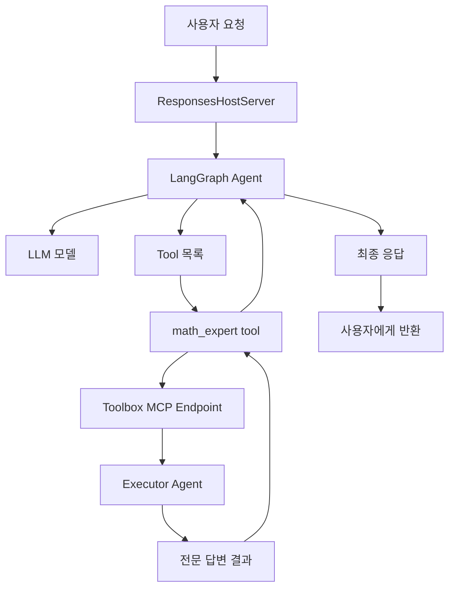

멀티 에이전트 시스템을 만들면서 정리한 **Caller/Executor 패턴** 구조를 기록해둔다. 사용자 요청을 받는 에이전트(Caller)와 실제 작업을 수행하는 전문 에이전트(Executor)를 분리하고, 둘 사이를 MCP(Model Context Protocol)로 연결하는 구성이다.

<!--more-->

## 구조 개요

역할은 둘로 나뉜다.

- **Caller (Concierge)**: 사용자의 요청을 받고, 필요하면 전문 에이전트에게 위임하는 관문 역할
- **Executor (전문 에이전트)**: 특정 도메인 작업(예: 수학 문제 풀이)을 실제로 처리하는 역할

핵심은 Caller가 Executor를 **직접 HTTP로 호출하지 않는다**는 점이다. Executor는 Foundry Toolbox를 통해 하나의 **tool**로 노출되고, Caller의 LLM이 질문을 보고 그 tool을 쓸지 말지 판단한다.

- LLM은 "어떤 tool을 쓸지"만 결정한다.
- 에이전트 런타임이 그 tool을 실제로 실행한다.
- tool 호출은 Toolbox/MCP 경로를 통해 Executor로 전달된다.

## Caller 초기화 흐름

Caller 진입점(`main()`)에서 하는 일은 크게 세 가지다: tool 로드 → 에이전트 생성 → 서버 실행.

| 순서 | 함수/객체 | 역할 |
|---|---|---|
| 1 | `main()` | 진입점 |
| 2 | `_load_toolbox_tools()` | Toolbox에서 tool 로드 |
| 3 | `DefaultAzureCredential()` | Azure 인증 객체 생성 |
| 4 | `get_bearer_token_provider()` | 토큰 공급자 생성 |
| 5 | `_ToolboxAuth` | 매 요청마다 최신 Bearer 토큰 주입 |
| 6 | `MultiServerMCPClient(...)` | Toolbox MCP 연결 |
| 7 | `client.get_tools()` | tool 목록 가져오기 |
| 8 | `_build_chat_model()` | Azure AI Foundry LLM 모델 객체 생성 |
| 9 | `create_agent(...)` | LangGraph 에이전트 생성 |
| 10 | `ResponsesHostServer(graph).run(...)` | 서버 실행 |

인증 처리가 눈여겨볼 부분인데, 토큰이 만료될 수 있으므로 고정 토큰을 쓰지 않고 `_ToolboxAuth` 같은 인증 객체가 **매 요청마다 최신 Bearer 토큰을 받아 주입**하는 구조로 만든다.

## 런타임 요청 처리 흐름

사용자가 질문을 보내면 다음 순서로 동작한다.

1. 요청이 서버(`ResponsesHostServer`)에 들어옴
2. 에이전트(graph)가 요청을 처리
3. LLM이 질문을 보고 tool 사용 여부를 판단
4. 필요하면 전문 에이전트 tool(예: `math_expert`)을 선택
5. tool 호출이 Toolbox/MCP 경로를 통해 Executor로 전달
6. Executor가 답변을 생성해 반환
7. Caller가 결과를 정리해 최종 답변을 사용자에게 반환

## 이 구조의 장점

- **역할 분리**: Caller는 라우팅에만 집중하고, 도메인 로직은 Executor에 격리된다. Executor를 추가해도 Caller 코드는 그대로다.
- **표준 프로토콜**: 에이전트 간 연결이 MCP라는 표준 경로를 타므로, Executor가 어떤 프레임워크로 만들어졌는지 Caller가 알 필요가 없다.
- **LLM의 판단 활용**: 어떤 요청을 위임할지 하드코딩하지 않고 LLM의 tool 선택에 맡긴다. tool의 이름과 설명(description)만 잘 써주면 된다.

## 핵심 정리

- LLM은 "어떤 tool을 쓸지" 결정한다.
- 런타임이 그 tool을 실제로 실행한다.
- tool은 Toolbox/MCP를 거쳐 Executor로 연결된다.
- Executor가 실제 전문 답변을 생성하고, Caller가 정리해 최종 응답을 만든다.

## 참고

- [Model Context Protocol](https://modelcontextprotocol.io/){:target="_blank"}
- [LangGraph](https://langchain-ai.github.io/langgraph/){:target="_blank"}
- [Microsoft Foundry](https://learn.microsoft.com/azure/ai-foundry/){:target="_blank"}
- [Foundry Toolkit for VS Code 소개 글]({{site.baseurl}}/tools/2025/04/13/aitools.html){:target="_blank"}
