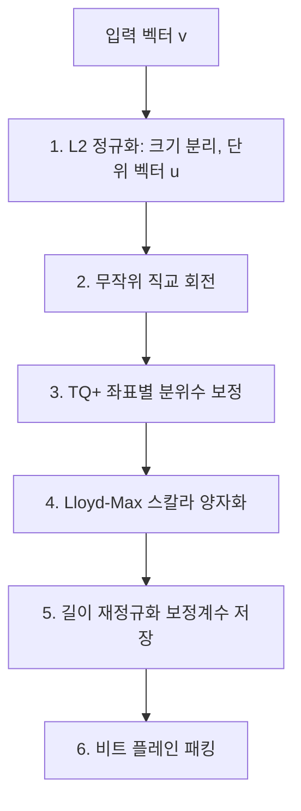

RAG 시스템에서 임베딩 벡터가 차지하는 RAM은 규모가 커질수록 부담이 된다. 구글 리서치의 **TurboQuant** 알고리즘(ICLR 2026 수락)을 Rust로 구현한 벡터 인덱스 라이브러리 [turbovec](https://github.com/RyanCodrai/turbovec)을 분석한 내용을 정리한다.

<!--more-->

> **TL;DR:** turbovec은 코드북 훈련 없이(Data-Oblivious) float32 임베딩을 8~16배 압축하고, ARM NEON / x86 AVX-512 SIMD 커널로 FAISS급 검색 속도를 내는 Rust 벡터 인덱스다. 수학적 분포 특성(무작위 회전 후 좌표가 Beta 분포를 따름)을 이용해 훈련 단계를 없앤 것이 핵심이며, LangChain·LlamaIndex 연동용 파이썬 바인딩을 제공한다.

## 왜 주목할 만한가?

- **훈련이 필요 없다**: FAISS PQ처럼 코드북을 만들기 위한 훈련 단계 없이 벡터 인제스트 즉시 인덱싱된다. 데이터가 계속 갱신되는 실시간 파이프라인에서 운용 비용이 크게 줄어든다.
- **메모리 8~16배 압축**: float32 벡터를 2~4비트로 양자화해, 로컬 PC RAM에서도 수천만 건 규모의 임베딩을 다룰 수 있다.
- **커널 레벨 하이브리드 필터**: Allowlist(허용 ID 마스크) 필터링을 검색 커널 안에서 직접 수행해, Post-Filtering 방식의 재현율 저하·오버페칭 문제를 원천적으로 피한다.

## 훈련 없이 어떻게 양자화하나? (TurboQuant)

인코딩 파이프라인은 다음 단계로 구성된다.



핵심 아이디어는 **2단계 무작위 직교 회전**에 있다. 단위 벡터에 deterministic하게 시딩된 직교 행렬을 곱하면, 고차원 구면 상의 회전 효과로 인해 **입력 데이터의 원래 분포와 무관하게** 회전 후 각 좌표가 Beta((d-1)/2, (d-1)/2) 분포를 따르게 된다. 분포를 수학적으로 미리 알 수 있으니 데이터로 코드북을 훈련할 필요가 없어지는 것이다.

나머지 단계는 이 이론을 현실 데이터에 맞추는 보정이다.

- **TQ+ 보정**: 유한 차원이나 임베딩의 이방성 때문에 좌표가 이론 분포에서 벗어나는 것을, 최초 1,000개 이상 샘플의 5%/95% 분위수로 좌표별 shift/scale을 피팅해 보정
- **Lloyd-Max 양자화**: Beta 분포 가정 하에 MSE를 최소화하는 경계값·대표값을 수치 적분으로 사전 계산해 2비트(4레벨)/4비트(16레벨) 정수로 변환
- **길이 재정규화**: 양자화 벡터의 크기 축소 편향(downward bias)을 RaBitQ 스타일 보정계수로 제거해, 검색 시 편향 없는 내적 추정치를 복원

## 어떻게 FAISS급 속도를 내나? (SIMD 설계)

- **비트 플레인 패킹**: 양자화 코드를 그대로 저장하지 않고 8개 좌표의 같은 비트를 모아 1바이트로 구성한다. ARM은 순차 레이아웃, x86은 AVX2의 크로스 레인 제약을 피하는 FAISS FastScan 스타일 인터리브 레이아웃을 쓴다.
- **LUT 기반 스캔**: 검색 시 DB 벡터를 역양자화하지 않는다. 쿼리를 회전 공간으로 변환해 점수 조견표(LUT)를 만들고, ARM NEON `vqtbl1q_u8`·x86 `_mm256_shuffle_epi8` 셔플 명령으로 바이트 연산만으로 점수를 계산한다.
- **Multi-Query Fused Kernel**: 쿼리 4개를 묶어 DB 코드 메모리 로드를 공유한다. AVX 미지원 CPU/VM을 위한 Scalar Fallback도 갖췄다.
- **Early-Exit 필터링**: 32개 벡터 블록 단위로 비트마스크를 검사해 허용 벡터가 없는 블록은 SIMD 연산 전체를 건너뛴다. 좁은 필터일수록 연산 비용이 0에 수렴한다.

## 코드 구조

```text
turbovec/
├── src/
│   ├── lib.rs        # 메인 인덱스, OnceLock 지연 캐시
│   ├── rotation.rs   # ChaCha8Rng + QR 분해로 직교 행렬 생성
│   ├── codebook.rs   # Lloyd-Max 코드북 산출 (Adaptive Simpson 적분)
│   ├── encode.rs     # 정규화→회전→보정→패킹 파이프라인
│   ├── pack.rs       # 비트 플레인 SIMD 레이아웃 변환
│   ├── search.rs     # NEON / AVX2 / AVX-512BW / Scalar 커널
│   ├── id_map.rs     # 외부 u64 ID ↔ 내부 슬롯 매핑
│   └── io.rs         # .tv/.tvim 직렬화 (DoS 방지 한계값 처리)
└── turbovec-python/  # PyO3 바인딩 + LangChain/LlamaIndex/Haystack 연동
```

## RAG 프레임워크 연동은 어떻게 하나?

파이썬 바인딩(`TurboQuantIndex`, `IdMapIndex`)이 NumPy와 호환되고, LlamaIndex용 `TurboQuantVectorStore`는 벡터는 압축 인덱스(`.tvim`)에, 텍스트·메타데이터는 JSON 사이드카(`.nodes.json`)에 분리 저장하는 패턴을 쓴다. 같은 `node_id`로 upsert하면 기존 슬롯을 `swap_remove`로 지우고 덮어써서 가비지 컬렉션 없이 조밀한 메모리 상태를 유지한다.

## 정리

훈련 없는 양자화(수학적 분포 이용), 어셈블리 수준 SIMD 커널, 커널 단 필터링 세 가지가 turbovec의 차별점이다. 임베딩 수백만 건 이상을 로컬/저비용 환경에서 서빙해야 하는 RAG 시스템이라면 FAISS 대비 운용 편의(훈련 불필요)와 메모리 효율 면에서 검토할 가치가 있다.

## 참고

- [GitHub: RyanCodrai/turbovec](https://github.com/RyanCodrai/turbovec){:target="_blank"}
- [FAISS](https://github.com/facebookresearch/faiss){:target="_blank"}
- [RaBitQ 논문](https://arxiv.org/abs/2405.12497){:target="_blank"}
