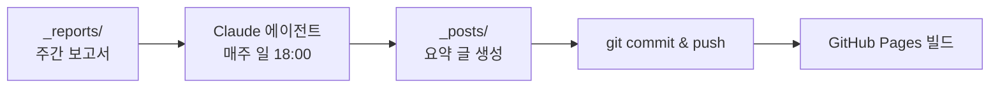

지난주부터 [RAG & AI 에이전트 주간 연구 동향]({{site.baseurl}}/dev/2026/07/19/rag_agent_weekly.html)이라는 주간 코너를 시작했다. 매주 쌓이는 연구 보고서를 사람이 손으로 요약해 발행하는 건 오래 못 갈 게 뻔해서, 이 과정을 Claude Code로 자동화했다. 클라우드 루틴(Routines)으로 시작했다가 로컬 작업 스케줄러로 방향을 튼 과정과, 그 과정에서 배운 것들을 기록한다.

<!--more-->

> **TL;DR:** `_reports/`의 주간 보고서를 읽어 블로그 글로 요약·커밋·푸시하는 에이전트를 만들었다. 클라우드 루틴은 GitHub 계정 OAuth 연결(App 설치와 별개!)이 필요해 보류하고, Windows 작업 스케줄러에서 `claude -p` 헤드리스 실행으로 전환했다. 프롬프트에는 중복 발행 방지, 미래 날짜 금지, 사실 창작 금지 같은 안전장치를 넣었다.

## 어떻게 동작하나요?

파이프라인은 단순하다. 주중에 조사한 내용이 `_reports/YYYYMMDD_report.md` 형식의 보고서로 쌓이면, 매주 일요일 저녁 에이전트가 이를 읽고 요약 글을 만들어 발행한다.



핵심은 스케줄러가 아니라 프롬프트다. 에이전트에게 매주 같은 일을 시키려면 프롬프트가 자기완결적이어야 하고, 잘못 동작했을 때의 피해를 프롬프트 안에서 막아야 한다.

## 프롬프트에 넣은 안전장치

몇 번의 시행착오 끝에 프롬프트에 다음 규칙들을 명시했다.

1. **보고서가 없으면 아무것도 하지 않기** — 7일 이내 날짜의 보고서가 없으면 발행 없이 종료. 오래된 보고서로 재탕 글을 만드는 사고를 막는다.
2. **중복 발행 방지** — 같은 기간의 글이 이미 `_posts/`에 있으면 종료. 스케줄러가 두 번 돌아도 안전하다.
3. **미래 날짜 금지** — front matter의 `date`가 현재 시각보다 미래면 GitHub Pages가 글을 조용히 빌드에서 제외한다(`future: true` 미설정 시). 에이전트가 밤 늦게 돌 때 실수하기 쉬운 부분이라 명시했다.
4. **사실 창작 금지** — 논문 제목·링크·수치는 보고서 원문 그대로만 쓰도록 했다. 요약 과정에서 LLM이 그럴듯한 arXiv 링크를 지어내는 것이 가장 경계할 실패 모드다.
5. **형식 고정** — 기존 글 하나를 "반드시 읽고 형식과 문체를 따르라"고 지정했다. 스타일 가이드를 장황하게 쓰는 것보다 실제 예시 파일 하나를 가리키는 쪽이 훨씬 잘 동작한다.

## 클라우드 루틴 vs 로컬 스케줄러, 뭐가 다른가요?

Claude Code는 [Routines](https://claude.ai/code/routines)라는 예약 실행 기능을 제공한다. cron 표현식으로 스케줄을 걸면 Anthropic 클라우드의 격리된 샌드박스에서 에이전트가 실행된다. 처음엔 이걸로 구성했다.

```json
{
  "name": "weekly-survey-rag",
  "cron_expression": "0 9 * * 0",
  "job_config": { "ccr": {
    "session_context": {
      "model": "claude-sonnet-5",
      "sources": [{"git_repository": {"url": "https://github.com/butteryoon/butteryoon.github.io"}}],
      "allowed_tools": ["Bash", "Read", "Write", "Edit", "Glob", "Grep"]
    }
  }}
}
```

여기서 `0 9 * * 0`은 UTC 기준이라 KST로는 일요일 18시다. 그런데 저장소를 `sources`에 추가하려니 계속 401 오류가 났다.

```
HTTP 401 {"error":{"message":"Connect your GitHub account before
saving a routine that uses a GitHub repository."}}
```

여기서 배운 것: **Claude GitHub App 설치와 계정 수준 GitHub OAuth 연결은 별개다.** App 설치는 PR 이벤트용 웹훅만 담당하고, 클라우드 에이전트가 저장소를 clone/push하려면 claude.ai 계정에 GitHub OAuth를 위임하는 별도 승인("Authorize Claude Code")이 필요하다. 로컬에서 커밋이 잘 되는 것과는 아무 상관이 없다 — 로컬 커밋은 내 PC의 git 자격증명을 쓰고, 클라우드 루틴은 사용자 PC 없이 돌기 때문이다.

OAuth 연결은 나중에 하기로 하고, 로컬 실행으로 전환했다. 두 방식의 트레이드오프는 이렇다.

| | 클라우드 루틴 | 로컬 스케줄러 |
|---|---|---|
| PC 전원 | 꺼져 있어도 실행 | 켜져 있어야 실행 |
| 저장소 접근 | GitHub OAuth 연결 필요 | 로컬 git 자격증명 그대로 사용 |
| 실행 환경 | 격리된 클라우드 샌드박스 | 내 PC (파일·환경 그대로) |
| 로그 확인 | claude.ai 웹에서 | 로컬 로그 파일 |

## Windows 작업 스케줄러로 어떻게 돌리나요?

`claude -p`(print 모드)를 쓰면 대화형 UI 없이 프롬프트 하나를 헤드리스로 실행할 수 있다. PowerShell 스크립트로 감싸 작업 스케줄러에 등록했다.

```powershell
$repo = "C:\path\to\blog"
$prompt = Get-Content "$HOME\.claude\local-routines\weekly-survey-rag-prompt.md" -Raw

Set-Location $repo
git pull --ff-only origin master

claude -p $prompt `
  --allowedTools "Read,Glob,Grep,Write,Edit,Bash(git add:*),Bash(git commit:*),Bash(git push:*)"
```

`--allowedTools`로 에이전트가 쓸 수 있는 도구를 명시적으로 제한했다. 헤드리스 모드에서는 권한 프롬프트에 답할 사람이 없으므로, `--dangerously-skip-permissions`로 전부 여는 대신 필요한 git 명령만 화이트리스트하는 쪽을 택했다. 파일 삭제나 임의 셸 명령은 애초에 실행 자체가 안 된다.

작업 등록은 한 줄이다.

```
schtasks /create /tn "weekly-survey-rag" `
  /tr "pwsh -NoProfile -ExecutionPolicy Bypass -File C:\...\weekly-survey-rag.ps1" `
  /sc weekly /d SUN /st 18:00
```

실행 로그는 스크립트에서 날짜별 파일로 리다이렉트해 남긴다. 잘 돌았는지 궁금하면 로그를 열어보거나, Claude Code 세션에서 "지난 일요일 발행 잘 됐는지 확인해줘"라고 물으면 된다.

## 클라우드 루틴으로 전환 (2026-07-22 추가)

로컬 스케줄러로 돌린 지 사흘 만에, 남은 과제 1번이었던 클라우드 전환을 완료했다.

1. **GitHub 연결 2단계 완료** — Claude GitHub App을 저장소에 설치하고, claude.ai 설정에서 계정 수준 GitHub OAuth 연결까지 마쳤다. 본문에서 배운 대로 이 둘은 별개 단계라 둘 다 필요했다.
2. **루틴은 웹 UI에서 생성** — 재미있게도 CLI 세션의 API로는 OAuth 연결 후에도 401이 계속 났다(세션 토큰이 연결 이전 발급분이라 갱신이 안 되는 듯). https://claude.ai/code/routines 웹 화면에서 직접 만드니 바로 됐다. 프롬프트는 로컬에서 쓰던 것을 그대로 옮겼다.
3. **로컬 스케줄러 제거** — 클라우드와 로컬이 같은 일요일 18시에 함께 돌면 이중 발행 위험이 있어, `schtasks /delete /tn weekly-survey-rag`로 작업을 삭제하고 스크립트·로그 폴더도 정리했다.

정리 전에 로컬 실행 로그를 확인해봤는데, 첫 일요일(7/19) 실행 2회 모두 "같은 기간의 글이 이미 존재한다"를 감지하고 발행 없이 종료해 있었다. 프롬프트에 넣어둔 **중복 발행 방지 안전장치가 실전에서 제 역할을 한 것**이다. 안전장치는 스케줄러를 갈아탈 때 진가가 드러난다 — 전환 기간에 두 스케줄러가 공존해도 사고가 나지 않았다.

이제 파이프라인은 "보고서를 `_reports/`에 커밋·푸시해두면, PC가 꺼져 있어도 일요일 저녁 클라우드에서 발행"으로 완성됐다.

## 남은 과제

- ~~**PC 의존성**: 일요일 저녁에 PC가 꺼져 있으면 그 주는 건너뛴다.~~ → 클라우드 루틴 전환으로 해소 (위 추가 섹션 참고)
- **보고서 생성의 자동화**: 지금은 보고서 작성까지는 수동이다. 조사 단계까지 에이전트화하면 완전 자동 파이프라인이 된다.
- **발행 전 검토**: 현재는 에이전트가 바로 push한다. 초안을 PR로 올리고 사람이 머지하는 방식이 더 안전할 수 있다.

## 참고

- [Claude Code Routines 문서](https://code.claude.com/docs/en/routines){:target="_blank"}
- [Claude Code 헤드리스 모드 (`claude -p`)](https://code.claude.com/docs/en/sdk/sdk-headless){:target="_blank"}
- [블로그 정리하기]({{site.baseurl}}/tools/2026/07/14/blog_maintenance.html) / [AI 검색 시대에 맞게 손보기]({{site.baseurl}}/tools/2026/07/16/blog_seo_llm.html) — 이 시리즈의 이전 글
