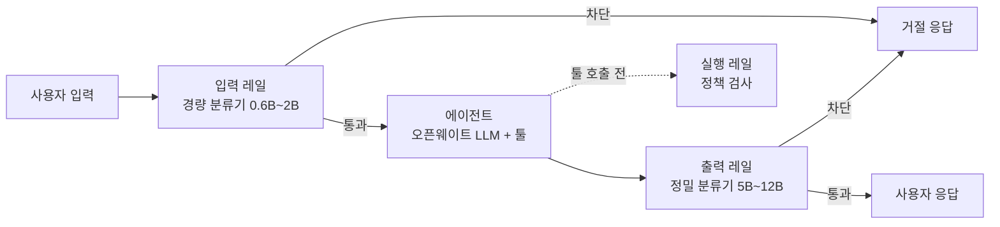

온프레미스 환경에서 오픈웨이트 LLM으로 에이전트를 구성할 때, 상용 API처럼 제공자가 걸어주는 안전장치가 없으므로 **가드레일을 직접 구성**해야 한다. 주요 오픈소스 가드레일 모델을 조사하고, 이를 에이전트 파이프라인에 배치하는 구성을 정리한다. (이 글의 서베이는 Claude Code 에이전트가 수행했다.)

<!--more-->

> **TL;DR:** 2026년 기준 쓸 만한 오픈소스 가드레일 모델은 Llama Guard 4(12B, 멀티모달), Qwen3Guard(0.6B~8B, 119개 언어·스트리밍), Granite Guardian(5B/8B, 프롬프트 인젝션·환각 탐지 강점), ShieldGemma 2(2B/4B, 저지연·이미지) 네 계열이다. 온프레미스 에이전트 파이프라인은 "입력 레일(경량 분류기) → 메인 LLM/에이전트 → 출력 레일(정밀 분류기)"의 샌드위치 구조가 기본이고, NeMo Guardrails 같은 오케스트레이션 레이어에 vLLM으로 서빙한 가드레일 모델을 연결하면 된다. 어떤 단일 모델도 만능이 아니므로 트래픽 특성(언어·모달리티·지연 예산)에 맞춰 조합하는 것이 핵심이다.

## 왜 가드레일 모델이 필요한가?

메인 LLM에게 "유해 요청은 거절하라"는 시스템 프롬프트만으로 안전을 맡기면, 프롬프트 인젝션 한 번에 뚫린다. 가드레일 모델은 메인 모델과 **독립적으로** 입력·출력을 분류하는 전용 소형 모델이라 다음이 가능하다.

- 메인 모델이 탈옥당해도 출력 단에서 한 번 더 걸러진다 (심층 방어)
- 수억 파라미터급 분류기라 GPU 비용·지연 부담이 작다
- 정책(차단 카테고리)을 메인 모델과 분리해 관리할 수 있다

특히 에이전트는 툴 실행이라는 실세계 행동이 있어서, 단순 챗봇보다 가드레일의 필요성이 크다.

## 주요 오픈소스 가드레일 모델 (2026년 기준)

| 모델 | 개발사 | 크기 | 특징 |
| :--- | :--- | :--- | :--- |
| Llama Guard 4 | Meta | 12B | MLCommons 위험 분류체계 기준, 텍스트+이미지 멀티모달 |
| Qwen3Guard | Alibaba | 0.6B/4B/8B | 119개 언어, Gen(전체 맥락)·Stream(토큰 단위 실시간) 두 변형 |
| Granite Guardian 4.1 | IBM | 5B/8B | 프롬프트 인젝션·환각 탐지 강점, 커스텀 판정 기준(BYOC) 지원 |
| ShieldGemma 2 | Google | 2B/4B | 저지연 프리필터용, 4B는 이미지 안전 분류 추가 |
| OpenGuardrails | 오픈소스 커뮤니티 | 14B (양자화 3.3B) | 모델+배포 인프라 통합 플랫폼, 요청별 정책·민감도 설정, 119개 언어, Apache 2.0 |

ICLR 2026 워크숍의 [벤치마크 연구](https://arxiv.org/html/2605.28830v1)에서 참고할 포인트:

- **프롬프트 민감도**: Qwen3Guard-8B와 Granite Guardian 8B는 프롬프트 표현이 바뀌어도 판정이 안정적(변동 ~1%)인 반면, ShieldGemma-2B는 민감도가 크다(변동 ~20%). 소형 모델을 쓸 때는 판정 프롬프트를 고정하고 회귀 테스트를 갖춰야 한다.
- **언어**: 한국어 트래픽이 많다면 다국어 커버리지가 넓은 Qwen3Guard가 우선 후보다.
- **역할 분담**: 어느 단일 모델도 전 카테고리 최강이 아니다 — 인젝션·환각은 Granite, 다국어·스트리밍은 Qwen3Guard, 멀티모달은 Llama Guard 4가 강하다.

### 주목할 만한 신규 옵션: OpenGuardrails

[OpenGuardrails](https://github.com/openguardrails/openguardrails)는 가드레일 "모델"이 아니라 **모델 + 배포 인프라를 통합한 최초의 완전 오픈소스 플랫폼**을 표방한다. 온프레미스 관점에서 눈여겨볼 특징:

- **요청별 정책 설정**: 다른 모델들이 고정된 분류 체계로 판정하는 것과 달리, 요청마다 탐지할 카테고리와 민감도(low/medium/high)를 동적으로 지정할 수 있다. logit 공간의 확률적 임계값 방식이라 민감도를 연속적으로 조정한다.
- **단일 모델 통합**: 콘텐츠 안전과 조작 방어(프롬프트 인젝션·탈옥)를 하나의 모델이 처리해, 용도별 모델을 조합하는 부담이 줄어든다.
- **배포 현실성**: 14B 모델을 GPTQ 양자화로 3.3B까지 줄이면서 벤치마크 정확도 98% 이상을 유지했다고 하며, REST API와 온프레미스 배포 스크립트를 함께 제공한다. 119개 언어 지원에 Apache 2.0 라이선스다.

정책을 코드 수정 없이 요청 단위로 바꿔야 하는 멀티테넌트 환경이나, 가드레일 서빙 인프라까지 한 번에 갖추고 싶은 경우 우선 검토할 만하다. 다만 비교적 신생 프로젝트이므로 도입 전 자체 트래픽 기준 벤치마크는 필수다.

## 온프레미스 에이전트 파이프라인 구성

기본 구조는 메인 에이전트를 가드레일로 감싸는 샌드위치다.

### 1. 서빙 계층

메인 LLM과 가드레일 모델을 모두 [vLLM](https://github.com/vllm-project/vllm)으로 서빙한다. 가드레일 모델은 작으므로 메인 모델과 같은 노드에 co-hosting하면 왕복 지연을 줄일 수 있다. GPU가 부족하면 입력 레일은 Qwen3Guard-0.6B나 ShieldGemma-2B 같은 초소형으로 시작한다.

### 2. 오케스트레이션 계층

[NeMo Guardrails](https://github.com/NVIDIA/NeMo-Guardrails)가 사실상의 표준 오케스트레이터다. 애플리케이션과 LLM 사이에 프록시로 앉아 input/dialog/retrieval/execution/output 5종 레일을 정책 코드(Colang)로 선언하고, LangChain·LangGraph 등과 통합된다. 더 가볍게는 파이프라인 코드에서 가드레일 모델을 직접 호출하는 구성도 가능하다 — 입출력 단 두 곳이라면 오케스트레이터 없이도 충분하다.

### 3. 배치 전략

- **입력 레일 (빠르게)**: 초소형 분류기로 명백한 유해 요청·인젝션 패턴을 선차단. 전체 트래픽이 통과하는 지점이라 지연 예산을 가장 아껴야 한다.
- **출력 레일 (정확하게)**: 차단 실패의 비용이 큰 지점이므로 5B~12B급 정밀 모델을 쓴다. RAG 구성이라면 Granite Guardian의 환각(groundedness) 탐지로 "근거 없는 답변"도 함께 거른다.
- **실행 레일 (에이전트 전용)**: 툴 호출 직전에 정책 검사를 넣는다. 허용 툴 화이트리스트, 파괴적 명령 차단 같은 결정적 규칙은 LLM 판정보다 코드 레벨 검사가 우선이다.
- **스트리밍 응답**: 출력을 스트리밍해야 한다면 Qwen3Guard-Stream처럼 토큰 단위 판정이 가능한 모델을 출력 레일에 배치한다.

### 4. 운영 체크리스트

1. 가드레일 판정 로그를 남겨 오탐(false positive)률을 주기적으로 측정 — 과차단은 사용자 이탈로 직결된다
2. 차단 카테고리·임계값을 정책 파일로 분리해 모델 교체 없이 조정 가능하게
3. 탈옥 프롬프트 셋으로 회귀 테스트 자동화 — 가드레일 모델 업그레이드 시 필수
4. 가드레일 모델도 LLM이다 — 가드레일 자체에 대한 인젝션 시도까지 로그로 감시

## 마무리

온프레미스 에이전트의 가드레일은 "어떤 모델을 쓰느냐"보다 **어디에 어떤 크기로 배치하느냐**의 문제에 가깝다. 입력은 작고 빠르게, 출력은 크고 정확하게, 툴 실행은 코드 레벨 규칙으로 — 이 원칙에서 시작해 트래픽의 언어·모달리티에 맞는 모델을 끼워 넣으면 된다. 이전에 정리한 [OpenRouter 무료 모델]({{site.baseurl}}/tools/2026/07/15/openrouter_free.html) 목록에 Nemotron Content Safety 같은 가드레일 모델도 있으니, 본격 구축 전에 무료 API로 판정 품질을 먼저 실험해보는 것도 방법이다.

## 참고

- [Benchmarking Open-Source Safety Guard Models (ICLR 2026 workshop)](https://arxiv.org/html/2605.28830v1){:target="_blank"}
- [Llama Guard 4](https://huggingface.co/meta-llama/Llama-Guard-4-12B){:target="_blank"}
- [Qwen3Guard](https://huggingface.co/collections/Qwen/qwen3guard-68d2729abbfae4716f3343a1){:target="_blank"}
- [Granite Guardian](https://huggingface.co/collections/ibm-granite/granite-guardian-66db06b1202a56cf7b079562){:target="_blank"}
- [ShieldGemma](https://ai.google.dev/gemma/docs/shieldgemma){:target="_blank"}
- [NVIDIA NeMo Guardrails](https://github.com/NVIDIA/NeMo-Guardrails){:target="_blank"}
- [OpenGuardrails 논문 (arXiv)](https://arxiv.org/abs/2510.19169){:target="_blank"} / [GitHub](https://github.com/openguardrails/openguardrails){:target="_blank"}
