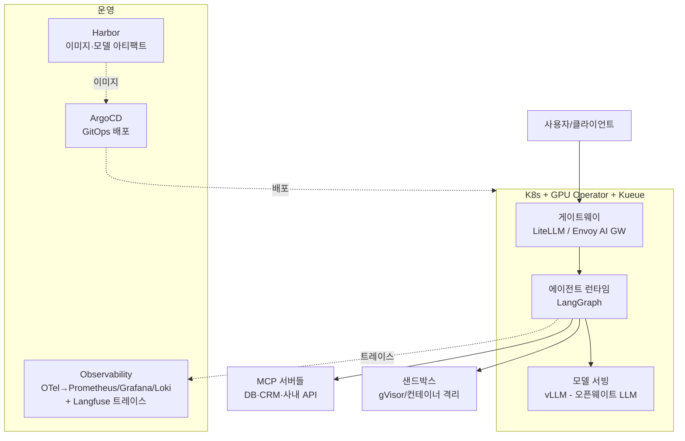

NVIDIA의 [Enterprise AI Factory 디자인 가이드](https://docs.nvidia.com/ai-enterprise/planning-resource/ai-factory-white-paper/latest/index.html) 중 "Agentic AI in the Factory" 챕터를 분석하고, 각 컴포넌트를 오픈소스 스택으로 치환하는 구성을 정리한다. (이 글의 서베이는 Claude Code 에이전트가 수행했다.)

<!--more-->

> **TL;DR:** NVIDIA는 에이전틱 AI 운영에 필요한 인프라를 9개 컴포넌트(AgentOps, AI Platform, Gateway, Data Connectors, GitOps Controller, Artifact Repository, Security, Observability, Cloud Native Platform)로 정의한다. 흥미로운 점은 이 아키텍처의 절반이 이미 오픈소스(MCP, ArgoCD, OpenTelemetry, GPU Operator, Kueue)를 전제로 한다는 것 — 나머지 NVIDIA 제품 자리(NIM, NeMo)에 vLLM·LangGraph·LiteLLM·Harbor·Langfuse를 끼우면 동일한 구조를 순수 오픈소스로 구성할 수 있다.

## NVIDIA가 정의하는 에이전틱 AI 인프라

가이드의 핵심 관점은 에이전트를 **"버전 관리·테스트·모니터링·롤백이 가능한 1급 서비스"**로 취급하라는 것이다. 정적 파이프라인이 아니라 "툴·메모리·정책을 조율하는 장기 실행 멀티스텝 에이전트 그래프"를 운영 대상으로 보며, 이런 워크플로우의 기술적 특성으로 세 가지를 꼽는다.

- **동적 라우팅(Dynamic Routing)**: 에이전트가 요청마다 적합한 모델·데이터 소스를 스스로 선택한다. 모든 요청을 최대 크기 모델로 보내는 대신 작업 난이도에 맞는 모델로 라우팅해 토큰 사용을 최적화하는 것 — 게이트웨이 계층이 단순 HTTP 라우터가 아니어야 하는 이유가 여기 있다.
- **지속 컨텍스트 관리(Persistent Context Management)**: 데이터셋과 중간 산출물을 가상 워크스페이스에 저장해 여러 상호작용에 걸쳐 컨텍스트를 유지한다. 대화가 끝나면 사라지는 세션 메모리가 아니라, 장기 실행 작업의 상태를 파일처럼 영속화하는 개념이다.
- **통합 평가(Integrated Evaluation)**: 평가 하니스를 워크플로우에 내장해, 추론 과정이 기업 데이터에 근거(grounded)하는지 투명하고 감사 가능하게 만든다.

이 특성들을 지탱하는 세 가지 기본 요소도 정의한다.

- **파일시스템**: S3·SQLite 등으로 백업되는 구조화된 워크스페이스 — 버전 관리와 재실행(replay)이 가능한 워크플로우의 기반
- **스킬(Skills)**: 인터페이스 명세와 실행 코드를 담은 디렉토리 형태의 "모듈화·버전화된 행동 단위"
- **샌드박스**: 네트워크·CPU/메모리·시간 제한이 걸린 격리 실행 환경

에이전트 스킬을 디렉토리+명세로 정의하는 방식은 Claude Code의 스킬이나 [OKF]({{site.baseurl}}/dev/2026/07/22/okf_review.html)의 "파일이 곧 지식" 철학과 정확히 같은 흐름이다. 업계가 같은 방향으로 수렴하고 있다.

## 9개 컴포넌트 분석과 오픈소스 매핑

| 컴포넌트 | 역할 | NVIDIA 스택 | 오픈소스 대체 |
| :--- | :--- | :--- | :--- |
| AgentOps | 에이전트 라이프사이클 운영 (버전·재현·트레이스 리플레이) | NeMo Agent Toolkit | LangGraph + Langfuse |
| AI Platform | 모델 서빙·커스터마이징·툴콜 API | NeMo, NIM | vLLM (+ LoRA 서빙) |
| Gateway | LLM 추론·A2A·MCP 트래픽 라우팅 | (표준화 진행 중) | LiteLLM, Envoy AI Gateway, Kong |
| Data Connectors | 엔터프라이즈 데이터·툴 동적 연결 | MCP 기반 | **MCP (이미 오픈 표준)** |
| GitOps Controller | Git 선언 상태 ↔ 클러스터 상태 동기화 | 예시로 ArgoCD 언급 | **ArgoCD, Flux (이미 오픈소스)** |
| Artifact Repository | 컨테이너·모델·스킬의 사내 버전 허브 | NIM 아티팩트 | Harbor + 이미지 스캐닝(Trivy) |
| Security | 네트워크 격리·IAM·최소 권한·감사 | Zero Trust RA, DPU | NetworkPolicy + Istio + Vault + Falco |
| Observability | 트레이싱·로깅·메트릭 | NeMo Toolkit 트레이싱, DCGM | **OpenTelemetry** + Prometheus/Grafana/Loki + Langfuse + DCGM-exporter |
| Cloud Native Platform | K8s 오케스트레이션·GPU 관리·스케줄링 | GPU/Network Operator | **K8s + GPU Operator(오픈소스) + Kueue/Volcano** |

굵게 표시한 항목들은 NVIDIA 가이드 자체가 오픈소스/오픈 표준을 그대로 참조하는 부분이다. 즉 이 아키텍처에서 실제로 "치환"이 필요한 것은 **모델 서빙(NIM→vLLM), 에이전트 프레임워크(NeMo Agent Toolkit→LangGraph), 게이트웨이** 정도다.

## 오픈소스 구성도

## 계층별 구성 노트

### 게이트웨이 — 아직 미성숙하다고 NVIDIA도 인정

가이드에서 가장 솔직한 대목이다. LLM 추론, 에이전트 간(A2A) 통신, MCP 트래픽을 다루는 게이트웨이 표준이 아직 없어서 "전용 마이크로서비스에 위임하고, 표준 API가 성숙하면 인그레스 게이트웨이로 수렴할 것"이라고 쓰고 있다. 오픈소스 진영도 마찬가지 상태라, 당장은 LiteLLM(모델 라우팅·키 관리·비용 추적)으로 시작하고 A2A/MCP 라우팅은 애플리케이션 레벨에서 처리하는 것이 현실적이다.

### AgentOps — 핵심은 트레이스 리플레이

"에이전트 스펙의 버전 관리, 샌드박스 실행, 기본 관측성(observable by default), 트레이스 리플레이"가 AgentOps의 요체다. 오픈소스로는 LangGraph의 체크포인트(상태 영속화·리플레이)와 Langfuse의 트레이스가 이 역할을 나눠 맡는다. LLM 시스템의 비결정성 때문에 트레이싱이 필수라는 지적은 실제 운영에서 절감하는 부분이다.

### 메트릭 — 무엇을 재야 하는지가 정리되어 있다

가이드가 제시하는 측정 항목은 그대로 체크리스트로 쓸 만하다: TTFT(첫 토큰 시간)·TPS·컴포넌트별 지연(계획 수립/추론/툴 호출/DB 질의), 태스크 완료율·RAG 정확도·충실도(faithfulness), GPU/CPU/메모리 사용률, 컴포넌트별 오류·타임아웃 빈도. 전부 OpenTelemetry 표준을 언급하므로 Prometheus/Grafana 스택에 자연스럽게 얹힌다. GPU 메트릭은 DCGM-exporter가 오픈소스로 제공된다.

### 보안 — 에이전트 특화 항목에 주목

일반 K8s 보안(NetworkPolicy, RBAC 3계층, 시크릿 관리, 이미지 스캐닝) 외에 에이전트 특화 요구가 명시되어 있다: **최소 권한 에이전트, 서명된 스킬 검증, 프로덕션 접근 통제**. 여기에 입출력 콘텐츠 필터링을 더하면 이전 글에서 다룬 [오픈소스 가드레일 파이프라인]({{site.baseurl}}/dev/2026/07/22/guardrail_onprem_pipeline.html)이 이 아키텍처의 Security 계층에 그대로 들어간다.

## 마무리

이 가이드에서 가져갈 것은 NVIDIA 제품 목록이 아니라 **컴포넌트 분해 그 자체**다. "에이전트를 마이크로서비스처럼 운영하라"는 원칙 아래 9개 역할을 정의한 프레임은 벤더 중립적이며, 실제로 절반은 이미 오픈소스를 참조한다. 온프레미스에서 오픈웨이트 LLM으로 에이전트 플랫폼을 구성한다면 — vLLM·LangGraph·LiteLLM·Harbor·ArgoCD·OpenTelemetry 조합으로 같은 구조를 세우고, GPU Operator와 Kueue로 자원 계층을 받치면 된다. 반대로 NVIDIA 검증 스택이 필요한 지점(인증 하드웨어, DPU 기반 격리, 기밀 컴퓨팅)은 요구사항에 따라 선택적으로 얹는 구조가 합리적이다.

## 참고

- [NVIDIA Enterprise AI Factory 디자인 가이드](https://docs.nvidia.com/ai-enterprise/planning-resource/ai-factory-white-paper/latest/index.html){:target="_blank"}
- [Agentic AI in the Factory (해당 챕터)](https://docs.nvidia.com/ai-enterprise/planning-resource/ai-factory-white-paper/latest/agentic-ai-in-the-factory.html){:target="_blank"}
- [vLLM](https://github.com/vllm-project/vllm){:target="_blank"} / [LangGraph](https://langchain-ai.github.io/langgraph/){:target="_blank"} / [LiteLLM](https://github.com/BerriAI/litellm){:target="_blank"} / [Langfuse](https://github.com/langfuse/langfuse){:target="_blank"}
- [Kueue](https://kueue.sigs.k8s.io/){:target="_blank"} / [NVIDIA GPU Operator](https://github.com/NVIDIA/gpu-operator){:target="_blank"}
- [오픈소스 가드레일 파이프라인 (이전 글)]({{site.baseurl}}/dev/2026/07/22/guardrail_onprem_pipeline.html)
