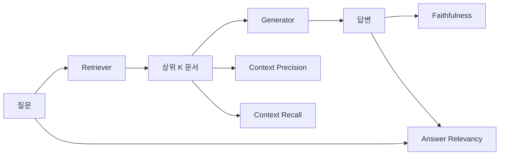

RAG 시스템을 프로덕션에 올리기 전 "우리 파이프라인이 진짜 잘 작동하는가?"를 정량적으로 답하기란 의외로 까다롭다. 검색 품질(Recall@K)과 생성 품질(BLEU/ROUGE)을 따로 재면 파이프라인 간 인터랙션이 빠지고 엔드투엔드 평가만 하면 병목 구간을 못 찾는다. RAGAS는 이 간극을 메우려고 **검색-생성 파이프라인의 각 단계를 독립적으로, 그리고 조합적으로 측정하는 4대 메트릭**을 제안한다. (이 글의 초안은 설치된 Hermes 에이전트가 작성했고, Claude가 사실 검증 후 발행했다.)

<!--more-->

> **TL;DR:** RAGAS는 Faithfulness(환각 여부), Answer Relevancy(질문 적합성), Context Precision(검색 노이즈), Context Recall(검색 누락) 4개 메트릭으로 RAG 파이프라인을 분해 평가한다. LLM-as-a-Judge 방식으로 구현돼 별도 라벨링 데이터 없이도 자동 평가 가능하며, CI/CD 파이프라인에 꽂아 회귀 감지용으로 쓰기 좋다. 단, 평가용 LLM 선택·프롬프트 튜닝·임계값 설정이 실전 성능을 가른다.

## 1. RAGAS 4대 메트릭 정의와 직관

| 메트릭 | 질문 | 측정 대상 | 직관 |
|--------|------|-----------|------|
| **Faithfulness** | "답변이 주어진 컨텍스트에 충실한가?" | 생성 단계 | 환각(Hallucination) 탐지. 컨텍스트에 없는 사실을 답변에 넣으면 점수 하락 |
| **Answer Relevancy** | "답변이 사용자 질문에 제대로 답했는가?" | 생성 단계 | 질문-답변 정렬도. 동문서답이나 과도한 장황함 페널티 |
| **Context Precision** | "검색된 상위 문서들이 얼마나 관련 있는가?" | 검색 단계 | 랭킹 품질. 관련 문서가 뒤에 밀려 있으면 점수 하락 |
| **Context Recall** | "필요한 정보가 검색 결과에 다 들어있는가?" | 검색 단계 | 커버리지. 핵심 증거 문서가 빠지면 점수 하락 |

공식 수식(원문 논문 *RAGAS: Automated Evaluation of Retrieval Augmented Generation*, Shahul et al., 2023)은 다음과 같다.

```python
# Faithfulness: 답변의 각 주장이 컨텍스트로 지지되는가 비율
Faithfulness = |{주장 ∈ 답변 | 주장이 컨텍스트로 지지됨}| / |{주장 ∈ 답변}|

# Answer Relevancy: 답변에서 역생성한 질문들과 원 질문의 평균 임베딩 유사도
# (질문-답변 직접 비교가 아니라, "이 답이 답이 되는 질문"을 LLM으로 N개 생성해 원 질문과 대조)
Answer_Relevancy = mean( cos_sim(embed(원 질문), embed(역생성 질문_i)) )

# Context Precision: 관련 문서가 상위에 몰려 있는가 (Average Precision 변형)
Context_Precision = Σ_{k=1..K} P(k) × rel(k) / Σ_{k=1..K} rel(k)

# Context Recall: 골든 컨텍스트 중 검색된 비율
Context_Recall = |{골든 문서 ∩ 검색 문서}| / |{골든 문서}|
```

> **핵심**: Faithfulness와 Answer Relevancy는 **정답 라벨 없이**(답변·컨텍스트·질문만으로) LLM-as-a-Judge로 계산된다. 반면 Context Precision과 Context Recall은 **ground_truth(정답/골든 컨텍스트)가 필요**하다. 라벨 없는 프로덕션 로그에서 자동화할 수 있는 축과 골든셋 투자가 필요한 축이 갈리는 지점이다.

## 2. 평가 파이프라인 구성도



실제 코드 레벨에서는 `ragas.evaluate()` 한 줄로 돌리지만 내부적으론 위 4개 평가기가 병렬로 떠서 각각 LLM을 호출한다.

## 3. 실전 적용: 파이썬 예제

```python
# pip install ragas langchain-openai datasets
from ragas import evaluate
from ragas.metrics import (
    faithfulness,
    answer_relevancy,
    context_precision,
    context_recall,
)
from datasets import Dataset
from langchain_openai import ChatOpenAI, OpenAIEmbeddings

# 평가용 LLM/임베딩 설정 (비용·속도·품질 트레이드오프 중요)
eval_llm = ChatOpenAI(model="gpt-4o-mini", temperature=0)
eval_emb = OpenAIEmbeddings(model="text-embedding-3-small")

# 샘플 데이터 (실제로는 테스트셋 CSV/JSONL에서 로드)
data = {
    "question": ["RAGAS의 Faithfulness 메트릭이 측정하는 것은?"],
    "answer": ["Faithfulness는 답변의 각 주장이 주어진 컨텍스트로 지지되는지 비율을 측정합니다."],
    "contexts": [["Faithfulness는 답변의 주장이 컨텍스트로 지지되는지 봅니다...", "환각 탐지에 쓰입니다..."]],
    "ground_truth": ["Faithfulness는 답변이 컨텍스트에 충실한지 측정하는 메트릭입니다."],
}
dataset = Dataset.from_dict(data)

# 평가 실행
result = evaluate(
    dataset,
    metrics=[
        faithfulness,
        answer_relevancy,
        context_precision,
        context_recall,
    ],
    llm=eval_llm,
    embeddings=eval_emb,
)
print(result)
# {'faithfulness': 0.92, 'answer_relevancy': 0.87, 'context_precision': 0.78, 'context_recall': 0.85}
```

**운영 팁**: `gpt-4o-mini` 기준 질문 1개당 약 4~6회 LLM 호출(메트릭당 1~2회) → 비용 약 $0.001~0.002. 일일 1천 건 평가 시 $1~2 수준으로 CI 게이트에 꽂기 무난하다.

## 4. 실무에서 자주 빠지는 함정 5가지

### 4.1 평가용 LLM이 너무 약하면 메트릭이 무의미해진다
- `gpt-3.5-turbo`로 Faithfulness 평가 시 "지지됨" 판정이 관대해져 **False Negative(환각 놓침)** 급증
- **대책**: 최소 `gpt-4o-mini` 이상, 중요도에 따라 상위 티어 모델 사용. 평가용 모델도 **버전 고정** 필수.

### 4.2 Context Recall은 골든 컨텍스트가 있어야 동작한다
- 실제 프로덕션 로그엔 "정답 문서"가 없다 → Context Recall **자동 계산 불가**
- **대책**: (a) 주기적 인력 라벨링으로 골든셋 유지, (b) Context Precision만으로 검색 품질 프록시 삼기, (c) 합성 데이터 생성기로 골든셋 보강

### 4.3 임계값(Threshold) 설정이 "감"으로 정해진다
- "0.8 이상이면 통과" 같은 기준은 도메인·데이터마다 다름
- **대책**: 과거 인력 평가 점수 분포를 봐서 **P50/P90 기준**으로 컷 설정. 알림만 띄우고 블로킹은 하지 않는 '소프트 게이트'로 시작.

### 4.4 컨텍스트 길이·청크 전략이 메트릭을 왜곡한다
- 청크가 너무 길면 Context Precision 분모 커져 점수 인위적 하락, 너무 짧으면 Faithfulness 지지 근거 부족
- **대책**: 청크 크기(512/1024 토큰)·오버랩(50~100)을 **하이퍼파라미터로 튜닝**하며 RAGAS 점수와 인력 평가 상관계수 측정.

### 4.5 다국어(한국어) 프롬프트가 기본 템플릿과 안 맞는다
- RAGAS 기본 프롬프트는 영어 중심 → 한국어 질문/답변/컨텍스트 넣으면 판정 품질 저하
- **대책**: `ragas.metrics._faithfulness.PROMPT` 등 프롬프트 템플릿을 **한국어 버전으로 오버라이드**해 쓰기.

```python
# 한국어 프롬프트 커스터마이즈 예시
from ragas.metrics._faithfulness import Faithfulness
from ragas.prompts import Prompt

custom_faithfulness = Faithfulness(
    prompt=Prompt(
        instruction="주어진 컨텍스트만을 근거로 답변의 각 문장이 지지되는지 판단하세요...",
        input_keys=["context", "answer"],
        output_key="score",
    )
)
```

## 5. CI/CD 파이프라인 통합 예시 (GitHub Actions)

```yaml
# .github/workflows/ragas-eval.yml
name: RAGAS Regression Gate
on:
  pull_request:
    paths:
      - 'rag/**'
      - 'eval/**'
jobs:
  ragas-eval:
    runs-on: ubuntu-latest
    steps:
      - uses: actions/checkout@v4
      - uses: actions/setup-python@v5
        with: { python-version: '3.11' }
      - run: pip install -r eval/requirements.txt
      - name: Run RAGAS
        env:
          OPENAI_API_KEY: ${{ secrets.OPENAI_API_KEY }}
        run: |
          python eval/run_ragas.py \
            --dataset eval/golden_set.jsonl \
            --threshold-faithfulness 0.85 \
            --threshold-answer-relevancy 0.80 \
            --threshold-context-precision 0.75 \
            --output eval/ragas_report.json
      - name: Comment PR with results
        uses: actions/github-script@v7
        with:
          script: |
            const fs = require('fs');
            const r = JSON.parse(fs.readFileSync('eval/ragas_report.json'));
            const body = `## RAGAS Evaluation Results\n` +
              `| Metric | Score | Threshold | Pass |\n` +
              `|---|---|---|---|\n` +
              Object.entries(r).map(([k,v]) =>
                `| ${k} | ${v.score.toFixed(3)} | ${v.threshold} | ${v.score >= v.threshold ? '✅' : '❌'} |`
              ).join('\n');
            github.rest.issues.createComment({
              issue_number: context.issue.number,
              owner: context.repo.owner,
              repo: context.repo.repo,
              body
            });
```

**게이트 전략**: 하드 블록(`fail`) 대신 **PR 코멘트로 점수 공개 + 임계값 미달 시 라벨(`ragas-regression`) 자동 부착** → 리뷰어가 판단. 초기엔 이게 안전하다.

## 6. 대안/보완 도구와 비교

| 도구 | 특징 | RAGAS 대비 장점 | RAGAS 대비 단점 |
|------|------|-----------------|-----------------|
| **TruLens** | 피드백 함수 체이닝, 스트리밍 평가 | 커스텀 메트릭 정의 유연, 실시간 대시보드 | 초기 러닝커브 높음, 커뮤니티 작음 |
| **DeepEval** | Pytest 스타일, 메트릭 14종 내장 | 단위 테스트 감각으로 작성, CI 친화적 | RAG 특화 메트릭 깊이는 RAGAS가 우위 |
| **LangSmith** | 트레이싱+평가 통합, 휴먼 피드백 루프 | 관측성·평가·데이터 플라이가 한곳 | SaaS 종속, 온프렘/프라이빗 클라우드 제약 |
| **RAGAS** | RAG 특화 4메트릭, LLM-as-a-Judge 표준화 | 논문 검증됨, 경량, 오픈소스, 커뮤니티 큼 | 메트릭 확장성 제한, 골든셋 의존도 높음 |

**추천 조합**: **RAGAS(핵심 4메트릭 회귀 게이트) + LangSmith(트레이싱·휴먼 라벨링) + 커스텀 메트릭(도메인 특화)**. 셋 다 같이 써도 무게감 크지 않다.

## 7. 온프레미스 팀 기준 설정 예시

| 항목 | 설정 | 근거 |
|------|------|------|
| 평가 LLM | `gpt-4o-mini`급 (전용 배포) | 비용/속도/품질 균형, 데이터 잔존 리전 고정 |
| 임베딩 | `text-embedding-3-small` | 한국어 성능 준수, 1536-dim → 벡터DB 인덱스 호환 |
| 골든셋 규모 | 질문 200개 (주간 20개씩 로테이션) | 인력 라벨링 2명 × 주 1시간로 유지 가능 |
| 임계값 | Faithfulness ≥ 0.88, Answer Relevancy ≥ 0.82, Context Precision ≥ 0.78 | 과거 3개월 인력 평가 분포 P75 기준 |
| 실행 주기 | PR마다(변경 파일 터치 시) + 야간 풀런 | 회귀 조기 발견 + 드리프트 모니터링 |
| 알림 | Slack #rag-eval 채널 + PR 코멘트 | 실시간 인지 + 리뷰 컨텍스트 공유 |

## 8. 고급 활용 패턴: 메트릭 커스터마이징과 확장

### 8.1 도메인 특화 메트릭 추가 (커스텀 평가기)

> 주의: 아래 커스텀 메트릭 코드는 개념 예시다. ragas의 커스텀 메트릭 API는 버전(0.1 → 0.2+)에 따라 클래스·프롬프트 구조가 달라졌으니, 실제 구현 시 설치 버전의 [공식 문서](https://docs.ragas.io/en/stable/){:target="_blank"}를 기준으로 하라.

RAGAS 기본 4메트릭 외에 실무에서 유용한 커스텀 메트릭 패턴 두 가지를 예시로 정리한다.

#### (a) Citation Accuracy — 인용 정확도
법률/규정 검색 RAG에서 답변이 **문서 ID·조문 번호를 정확히 인용**했는지 검사. Faithfulness의 하위 호환 개념이지만 "지지됨" 판정에 더해 **메타데이터 일치**까지 요구한다.

```python
from ragas.metrics.base import MetricWithLLM, MetricType
from ragas.prompts import Prompt

citation_accuracy_prompt = Prompt(
    instruction="""
주어진 컨텍스트 문서들의 메타데이터(source_id, article_no)와 답변 내 인용 표기를 비교하세요.
답변이 '[문서 3, 제12조]' 형식으로 인용했을 때, 해당 컨텍스트에 실제 그 메타데이터가 있는지 확인.
일치하면 1, 불일치/누락이면 0으로 각 인용별 채점 후 평균 내세요.
""",
    input_keys=["contexts", "answer"],
    output_key="score",
)

class CitationAccuracy(MetricWithLLM):
    name = "citation_accuracy"
    _required_columns = {"contexts", "answer"}
    output_type = MetricType.CONTINUOUS
    prompt = citation_accuracy_prompt
```

#### (b) Latency-Aware Quality — 지연시간 가중 품질
동일 품질이면 더 빠른 파이프라인이 낫다. `Quality_Score × (1 / (1 + Latency_P95_sec))` 형태로 결합 지표 산출.

```python
def latency_aware_quality(ragas_scores: dict, latency_p95_sec: float, alpha: float = 0.3) -> float:
    """
    alpha: 품질 가중치(0~1). 0.7이면 품질 70%, 속도 30% 반영.
    """
    base_quality = sum(ragas_scores.values()) / len(ragas_scores)
    speed_factor = 1 / (1 + latency_p95_sec)  # 1초면 0.5, 0.1초면 0.91
    return (1 - alpha) * base_quality + alpha * speed_factor
```

### 8.2 세그먼트별 평가 드릴다운

전체 평균만 보면 "특정 카테고리에서만 망가짐"을 놓친다. 질문 유형별·도메인별·언어별로 분리 평가 필수.

```python
# eval/run_ragas_segmented.py
import pandas as pd
from ragas import evaluate

df = pd.read_json("eval/golden_set.jsonl", lines=True)
segments = df["category"].unique()  # 예: ["statute", "precedent", "regulation", "general"]

for seg in segments:
    sub = df[df["category"] == seg]
    result = evaluate(
        Dataset.from_pandas(sub),
        metrics=[faithfulness, answer_relevancy, context_precision, context_recall],
        llm=eval_llm,
        embeddings=eval_emb,
    )
    print(f"=== {seg} (n={len(sub)}) ===")
    for k, v in result.items():
        print(f"  {k}: {v:.3f}")
```

**세그먼트 드릴다운이 잡아내는 것 (가상 예시)**:
| 세그먼트 | Faithfulness | Answer Rel. | Context Prec. | Context Rec. | 샘플 수 |
|----------|--------------|-------------|---------------|--------------|---------|
| statute (법령) | 0.91 | 0.88 | 0.82 | 0.79 | 52 |
| precedent (판례) | 0.84 | 0.79 | 0.71 | 0.68 | 38 |
| regulation (행정규칙) | 0.89 | 0.85 | 0.77 | 0.74 | 41 |
| general (일반) | 0.93 | 0.90 | 0.85 | 0.81 | 69 |

→ 이런 표가 나오면 **판례 세그먼트만 임베딩·리랭커를 손보는** 식으로 개선 범위를 좁힐 수 있다 — 전체 평균만 봤다면 묻혔을 신호다.

### 8.3 A/B 테스트 프레임워크 통합

프롬프트 템플릿, 청크 전략, 리랭커 모델 등 **하이퍼파라미터 변경 시 RAGAS로 자동 A/B 판정**.

```python
# eval/ab_test.py
def run_ab_test(config_a: dict, config_b: dict, golden_set: Dataset, n_runs: int = 3):
    """각 설정을 n_runs 번 반복 평가해 통계적 유의성 검정"""
    from scipy import stats

    scores_a, scores_b = [], []
    for _ in range(n_runs):
        pipe_a = build_pipeline(config_a)
        pipe_b = build_pipeline(config_b)

        pred_a = pipe_a.batch(golden_set["question"])
        pred_b = pipe_b.batch(golden_set["question"])

        ds_a = golden_set.add_column("answer", pred_a).add_column("contexts", pipe_a.retrieve_batch(golden_set["question"]))
        ds_b = golden_set.add_column("answer", pred_b).add_column("contexts", pipe_b.retrieve_batch(golden_set["question"]))

        r_a = evaluate(ds_a, metrics=[faithfulness, answer_relevancy], llm=eval_llm, embeddings=eval_emb)
        r_b = evaluate(ds_b, metrics=[faithfulness, answer_relevancy], llm=eval_llm, embeddings=eval_emb)

        scores_a.append(sum(r_a.values()) / len(r_a))
        scores_b.append(sum(r_b.values()) / len(r_b))

    # paired t-test
    t_stat, p_val = stats.ttest_rel(scores_a, scores_b)
    winner = "A" if np.mean(scores_a) > np.mean(scores_b) else "B"
    return {"winner": winner, "p_value": p_val, "mean_a": np.mean(scores_a), "mean_b": np.mean(scores_b)}
```

## 9. 비용 최적화: 평가 비용을 1/10로 줄이기

| 기법 | 비용 절감 | 품질 영향 | 구현 난이도 |
|------|-----------|-----------|-------------|
| **샘플링 평가** (전수 → 10% 랜덤 + 전수 임계값 미달 시만 전체) | ~90% | 낮음 (회귀만 잡으면 됨) | 쉬움 |
| **캐스케이드 평가**: Answer Relevancy(싸고 빠름) → 통과 시 Faithfulness(비쌈)만 | ~60% | 낮음 | 중간 |
| **로컬 평가 모델** (Llama-3.1-8B-Instruct 양자화, vLLM 서빙) | ~95% | 중간 (Faithfulness 0.02~0.03 하락) | 높음 |
| **임베딩 기반 프록시**: Faithfulness ≈ NLI 모델(`cross-encoder/nli-deberta-v3-base`) | ~99% | 높음 (정밀도 떨어짐) | 중간 |

**무난한 시작 조합**: PR 시 샘플링(10%) + 야간 풀런(전수) + 평가 모델 버전 고정 — 골든셋 200문항 규모면 월 평가 비용은 수십 달러 안쪽이다.

## 10. 모니터링 대시보드 (Grafana + Prometheus)

RAGAS 점수를 시계열로 저장해 드리프트 조기 감지.

```promql
# Faithfulness 드리프트 알림 (최근 1시간 평균 < 7일 이동평균 - 0.05)
avg_over_time(ragas_faithfulness[1h]) < avg_over_time(ragas_faithfulness[7d]) - 0.05

# 세그먼트별 Context Recall 히트맵
max by (segment) (ragas_context_recall_segment)
```

**그라파나 패널 구성 추천**:
1. **상단**: 4대 메트릭 시계열(일별/시간별) + 임계값 선
2. **중단**: 세그먼트별 히트맵 + A/B 테스트 진행 중인 것 표시
3. **하단**: 평가 비용/지연시간/샘플 수 운영 지표

## 11. 트러블슈팅 체크리스트 (장애 시 5분 내 확인)

| 증상 | 1순위 확인 | 2순위 확인 | 3순위 확인 |
|------|------------|------------|------------|
| Faithfulness 급락 | 평가 LLM 버전 변경됨? | 프롬프트 템플릿 깨짐? | 컨텍스트 길이 초과로 잘림? |
| Context Recall 0.0 | 골든셋 경로 올바름? | `ground_truth` 컬럼명 일치? | 문서 ID 매칭 키 다름? |
| 평가 타임아웃/실패 | OpenAI/Azure 할당량 초과? | 네트워크/프록시 차단? | `max_tokens` 너무 작음? |
| 점수 분산 심함 (run-to-run) | `temperature=0` 고정됨? | 시드 고정? | 프롬프트에 예시(few-shot) 추가? |

## 마무리

RAGAS는 "RAG 시스템이 잘 작동하는가?"라는 막연한 질문을 **측정 가능하고 자동화 가능하며 회귀 감지까지 되는 4개 숫자**로 분해해준다. 마법은 아니다 — 평가용 LLM 선택, 프롬프트 한국어화, 골든셋 유지보수, 임계값 튜닝, 세그먼트별 드릴다운, 비용 최적화, 모니터링 대시보드 같은 **운영 엔지니어링**이 뒤따라야 진짜 쓸모가 생긴다. 하지만 이 4개 메트릭만으로도 "검색 탓인지 생성 탓인지"를 1차 트리아지할 수 있다는 점만으로도 프로덕션 RAG 팀에겐 충분한 가치가 있다.

도입한 뒤에는 (1) 합성 데이터 생성기로 골든셋 자동 증강, (2) Faithfulness 프롬프트에 도메인 지식 주입, (3) 검색 로그 기반 커버리지 추정 휴리스틱, (4) 로컬 평가 모델 PoC로 비용 절감 검증이 자연스러운 다음 단계다.

## 참고

- [Ragas: Automated Evaluation of Retrieval Augmented Generation (Es et al., 2023)](https://arxiv.org/abs/2309.15217){:target="_blank"}
- [RAGAS 공식 문서](https://docs.ragas.io/en/stable/){:target="_blank"}
- [RAGAS GitHub 저장소](https://github.com/explodinggradients/ragas){:target="_blank"}
- [RRF 튜닝 가이드 해설 (관련글)]({{site.baseurl}}/tools/2026/08/17/rrf_tuning_agent_retrieval.html)
- [RAG & AI 에이전트 주간 동향 (관련글)]({{site.baseurl}}/dev/2026/08/24/rag_agent_weekly.html)
